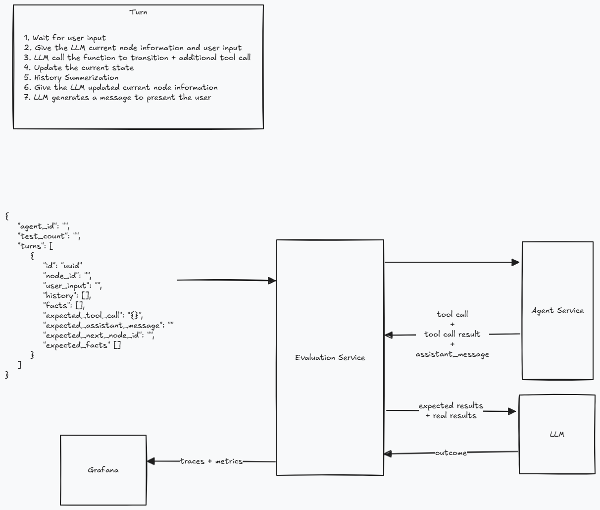
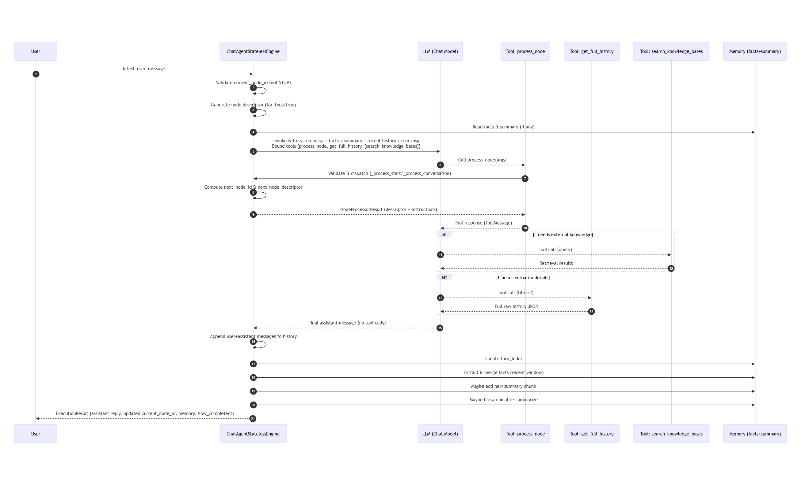
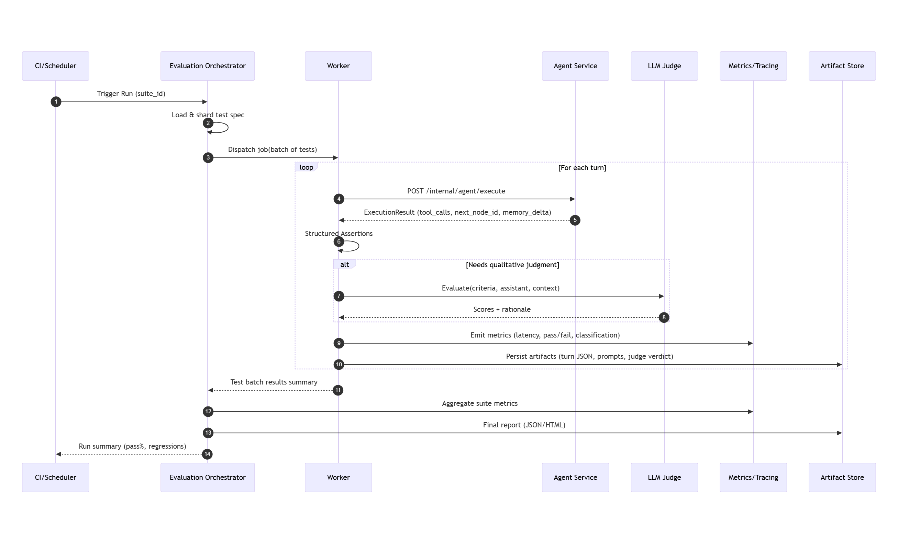
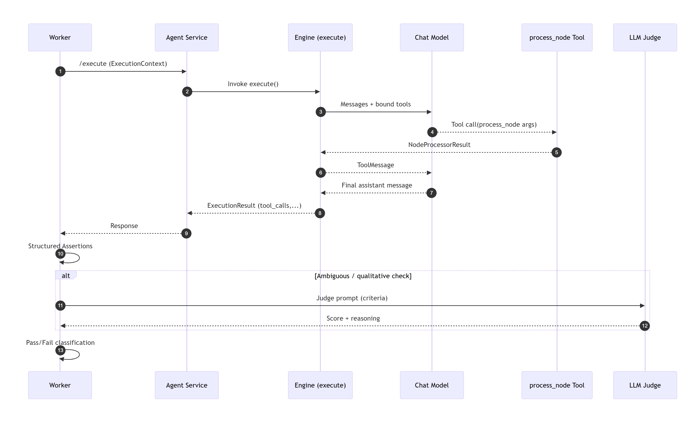

# Evaluation Service Design & Integration with Chat Agent Flow Engine

This document proposes an architecture for an automated Evaluation Service that mass‑tests the
`ChatAgentStatelessEngine` conversational node flow. It extends the initial sketch (shown below) with richer components, deterministic hooks, and
LLM (judge) evaluation strategies.

<figure>
  
  <figcaption>Figure 1: Initial sketch of the evaluation service architecture showing the main components and their relationships.</figcaption>
</figure>

## Chat Agent Execution Flow

Before diving into the evaluation service, let's explore in detail the steps of the high‑level turn cycle lifecycle mentioned above. A sequence diagram of the execution flow is included below to aid comprehension.

1. Wait for user input

   - External caller supplies an `ExecutionContext` containing:
   - `current_node_id`: ID of the flow node we are logically “in”.
   - `latest_user_message`: Raw user text for this turn.
   - `history`: Dense chronological list of prior messages (role + content) kept verbatim (unsummarized source of truth).
   - `memory`: Evolving `MemoryState` (turn index, extracted facts, hierarchical summary chunks, etc.).

2. Provide the LLM with current node information and user input

   - Engine resolves / validates the current node (must not be a STOP node for execution start).
   - Builds a dynamic tool schema for `process_node` based on node type (Start vs Conversation) using parameter pydantic models.
   - Generates a node descriptor (with `prompt`, node type, options, hidden "-1" stay option for conversation nodes when invoked as a tool).
   - Assembles the prompt messages:
   - System root message (base instructions + enforced process_node usage contract).
   - (Optional) Facts system message (authoritative canonical corrections / durable claims).
   - (Optional) Summary system message (hierarchical, non‑verbatim aggregated prior context).
   - Recent original history window (selected with a sliding strategy to keep token budget bounded while preserving grounding).
   - Latest user message appended as a Human message.

3. LLM invokes the transition function (tool) and may issue additional tool calls

   - Tools bound:
     - `process_node` (always, tool_choice pre-selected so LLM must call it first for this turn).
     - `get_full_history` (exposes full raw history when precise recall of earlier details is required beyond summary & window).
     - Optional global tools (e.g., `search_knowledge_bases`) if knowledge bases configured.
   - The first assistant output is expected to be a tool call to `process_node` with structured args:
     - Start node → requires `current_node_id`, `next_node_id`.
     - Conversation node → requires `current_node_id`, chosen `option_id` (or `-1` to remain in node without advancing).
   - Engine validates + executes node processing method:
     - `_process_start_node`, `_process_conversation_node`, (or internally `_process_stop_node` if ever invoked at end).
     - Produces a `NodeProcessorResult`: `next_node_id`, optional `next_node_descriptor`, human‑readable `instructions`.
   - Returns a serialized tool result (descriptor + instructions) back into the LLM conversation as a `ToolMessage`.
   - The LLM may then:
     - Use the descriptor/instructions to produce a final natural language response to the user.
     - Optionally call `get_full_history` if it needs verbatim earlier context.
     - Optionally call a knowledge base search tool for retrieval augmentation.
   - A recursive / iterative loop (implemented via `process_tool_calls_recursively`) consumes tool calls until the LLM emits a normal assistant message (no further tool invocation payloads).

4. Update the current state

   - Once a final assistant message (non‑tool) is produced:
     - Append the user message (this turn) to `history` (role = user).
     - Append the assistant message (role = assistant) including any debug / trace info.
     - Advance `memory.turn_index` (assistant turns count) after persisting the assistant response.
     - Update `current_node_id` to the resolved `next_node_id` from node processing (flow progression). If `next_node_id` is `None`, flow is considered completed.

5. History summarization (memory update pipeline)

   - Fact extraction / merging:
     - Selects a recent window of original history (not the summarized form) and runs an extraction model prompt to pull durable factual statements or corrections.
     - Merges them into `memory.facts` (idempotent + correction aware).
   - Original history summarization:
     - Checks threshold (e.g., number of turns since last chunk) to decide whether to create a new summary chunk.
     - If created, appends a compact slice summary to `memory.summary.chunks` referencing turn span metadata.
   - Hierarchical re-summarization:
     - When chunk count becomes large or compression criteria met, folds existing chunks into a higher‑level synthesized summary (increasing `summary.level`).
   - Errors in any memory stage are caught/logged but do NOT abort the user turn (best-effort resilience).

6. Provide the LLM with updated current node information (next‑turn preparation)

   - Not executed immediately again inside the same turn; instead, the engine returns updated `ExecutionResult` containing:
     - `current_node_id` (new node for next user input).
     - Updated `history` (verbatim originals — canonical source for future summarization / retrieval).
     - Updated `memory` (facts + hierarchical summaries).
     - `flow_completed` flag (True if next node is `None` or STOP reached).
   - On the _next_ invocation of `execute()`, the above updated state seeds step (2) for the new user input.

7. LLM generates a message to present to the user
   - The final assistant message is shaped by:
     - Node descriptor prompt of the _next_ node (if advanced) or current node (if stayed).
     - Instructions returned by the node processor (e.g., “Reply based on prompt …”).
     - Any optional retrieval results (knowledge base tool call outputs) injected as intermediate tool messages.
     - System guardrails (facts + summary messages) ensuring consistency, brevity, and user‑aligned continuity.

### Sequence Diagram

<figure>
  
  <figcaption>Figure 2: Sequence diagram of a single chat engine execution.</figcaption>
</figure>

## Evaluation Service

The evaluation flow is easier to grasp visually; the sequence diagrams below illustrate the process, which the subsequent narrative explains step by step.

<figure>
  
  <figcaption>Figure 3: Sequence diagram of the evaluation engine.</figcaption>
</figure>

<figure>
  
  <figcaption>Figure 4: Sequence diagram of a single turn interaction of the evaluation engine.</figcaption>
</figure>

## Higher‑Level Components

1. Test Spec Repository + Scheduler (Optional)

- Test Spec Repository (Git / DB / S3) – Stores declarative JSON/YAML test suites.
- Optional scheduler to automate large‑scale test execution or integrate with the CI pipeline.
- Not a near‑term priority because the evaluation pipeline can be triggered manually.

2. Evaluation Service

- Evaluation Orchestrator – Accepts run requests; shards suites into executable jobs; manages lifecycle and aggregation.
- Execution Worker Pool – Stateless workers that execute assigned test turns against the Agent Service.
- Assertion Engine – Performs structured comparisons (tool call arguments, node transitions, fact deltas, response heuristics) before escalating to the LLM judge.
- LLM Judge Adapter – Normalizes prompts to the judge model (e.g., GPT‑5 or fallback) and caches adjudications.
- Report Generator – Produces HTML / Markdown / JSON summaries (pass rates, flakiness, regression diffs).

3. Metrics & Tracing Layer – Emits Prometheus counters and histograms; OpenTelemetry spans correlate `test_case_id` and `conversation_id`.
4. Artifact Store – Persists per‑turn artifacts (prompt snapshots, tool results, deltas, judge reasoning) for triage (optional).

## Required Changes to the Agent Service

The evaluation framework needs several enhancements in the Agent Service to enable deterministic, observable, and
high‑throughput test execution. Each required change is summarized below with its rationale and concrete
implementation detail.

-- Create a new websocket endpoint (`POST /internal/agent/test`): This mirrors the public/web websocket but allows specifying model parameters (e.g., `{ "temperature": 0, "top_p": 1, "seed": <int?>, "enable_tracing": true }`).
-- Execution dry‑run flag: Allows running a turn without committing side effects to persistent memory. Add
`dry_run: bool` to `ExecutionContext`; when true, skip persisting fact/summary updates and do not increment
`turn_index`.
-- Return tool call trace details: Provides intermediate visibility into reasoning for assertions. Extend
`types.ExecutionResult` with `tool_calls: [{ name, args, result, latency_ms }]`, populated from the
`process_tool_calls_recursively` debug flow.
-- Expose full node descriptor after transition: Facilitates assertions on the next node’s structure. Surface the
existing tool‑produced descriptor as `next_node_descriptor` in the final `ExecutionResult`.
-- Fact extraction toggle: Permits disabling parts of the memory pipeline to isolate other behaviors. Add a
`memory_pipeline: { enabled: bool, stages?: [facts, summarize, resummarize] }` structure in the context.

## Test Specification Schema

Proposed JSON (versioned) allowing future backward compatibility:

```
{
	"version": "v1",
	"suite_id": "flow_customer_support_v1",
	"description": "Validate onboarding flow and correction logic",
	"metadata": { "owner": "team-xyz", "priority": "P1" },
	"defaults": {
		"max_turns": 20,
		"llm_judge": { "model": "gpt-5", "criteria": ["helpfulness", "faithfulness", "style"] }
	},
	"tests": [
		{
			"test_id": "start_handoff_path",
			"initial_node_id": "start",
			"seed": 42,
			"turns": [
				{
					"turn_id": "t1",
					"user_input": "Hello",
					"expected": {
						"tool_call": { "name": "process_node", "args.partial": { "current_node_id": "start" } },
						"next_node_id": "conv_1",
						"assistant_contains": ["welcome"],
						"facts_add": [ { "key": "user_greeting", "value": "hello" } ]
					}
				},
				{
					"turn_id": "t2",
					"user_input": "Option 2",
					"expected": {
						"next_node_id": "conv_2",
						"node_descriptor.options_contains": [ { "id": "opt_2" } ]
					}
				}
			],
			"final_assertions": {
				"flow_completed": false,
				"forbidden_facts": ["incorrect_price"],
				"judge_criteria": {
					"assistant_quality_min": 0.7
				}
			}
		}
	]
}
```

Assertion Key Types:

| Key                                | Meaning                                                   |
| ---------------------------------- | --------------------------------------------------------- |
| `tool_call`                        | Expected first tool invocation (name + partial arg match) |
| `next_node_id`                     | Post-turn node pointer                                    |
| `assistant_contains`               | Substrings that must appear in assistant message          |
| `assistant_not_contains`           | Substrings forbidden                                      |
| `facts_add` / `facts_update`       | Expected memory fact changes                              |
| `node_descriptor.options_contains` | Ensure option presence                                    |
| `judge_criteria`                   | LLM-judged qualitative thresholds                         |
| `flow_completed`                   | Terminal flow expectation                                 |

---

## Evaluation Workflow (Turn Level)

1. Load test spec & validate schema (JSON Schema / Pydantic).
2. Initialize conversation state (empty history, optional seeded memory).
3. For each turn in `turns`:
   - Build an `ExecutionContext` with deterministic flags.
   - Invoke the Agent Service `/execute` endpoint.
   - Collect the `ExecutionResult` and trace IDs.
   - Run structured assertions:
     - Node transitions
     - Tool invocation sequence
     - Assistant text heuristics (regex / optional semantic embedding similarity)
     - Memory fact deltas
   - If any qualitative criteria are unmet or ambiguous, call the LLM judge.
   - Cache the judge verdict keyed by a hash of (`turn_input` + `assistant_output` + `criteria`) to avoid recomputation.
   - Record pass/fail classification.
4. After all turns: run `final_assertions`.
5. Emit aggregated metrics + generate artifacts.

Failure Classification:

| Code                 | Description                          | Source               |
| -------------------- | ------------------------------------ | -------------------- |
| `NODE_MISMATCH`      | Unexpected next node id              | Structured assertion |
| `TOOL_ARGS_MISMATCH` | Tool call args deviate               | Structured assertion |
| `ASSISTANT_CONTENT`  | Missing/forbidden substrings         | Structured assertion |
| `FACT_DRIFT`         | Expected fact not added / mismatch   | Memory assertion     |
| `QUALITY_JUDGE_FAIL` | Judge score below threshold          | LLM judge            |
| `ENGINE_ERROR`       | 5xx / exception from Agent           | Transport layer      |
| `TIMEOUT`            | Agent did not respond within SLA     | Orchestrator         |
| `FLAKY`              | Non-deterministic diff across reruns | Post-processing      |

Retry Strategy: For transient `ENGINE_ERROR` / `TIMEOUT`, up to N (configurable, e.g., 2) retries before hard fail; judge calls are NOT retried unless network error.

Parallelization: Group tests by graph complexity and expected maximum turns to balance worker load; maintain per‑conversation sequential ordering.

## 7. LLM Judge Strategy (GPT‑5 or Alternatives)

Considerations when using GPT‑5 (assuming availability):

1. Primary: `gpt-5` (when criteria complexity > threshold or prior judge failures).
2. Secondary: `gpt-4.1` (cost‑saving) for simpler criteria (e.g., factual alignment, tone adherence).

Judge Prompt Template (Abstract):

```
SYSTEM: You are a strict evaluator. Provide JSON only.
USER: {
	"assistant_message": "...",
	"expected_criteria": {"helpfulness": true, "faithfulness": true},
	"context_excerpt": "... (node prompt / facts) ..."
}
ASSISTANT: {"scores": {"helpfulness": 0.85, "faithfulness": 0.90}, "fail_reasons": []}
```

Please keep in mind that the above design may change during the implementation phase.
